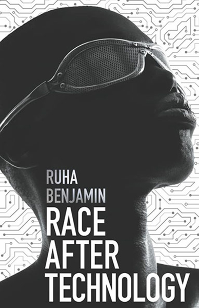
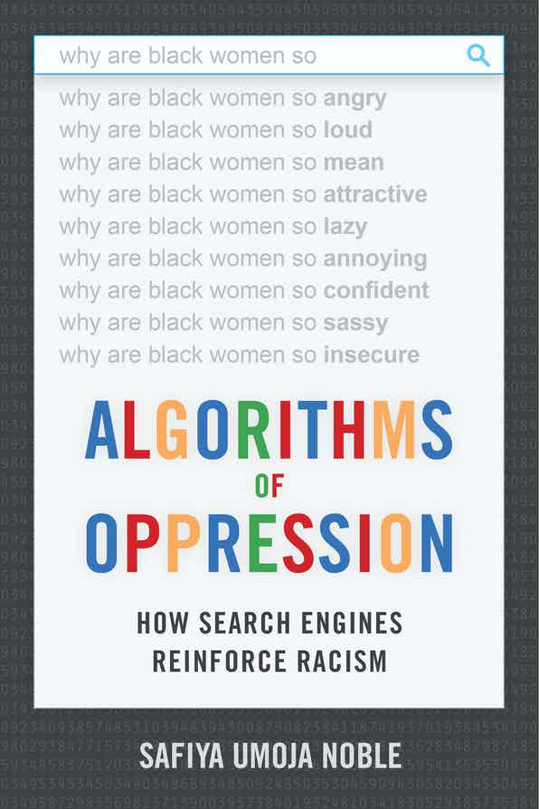
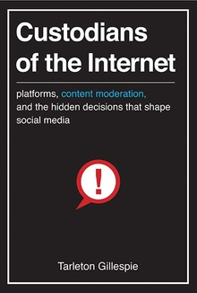
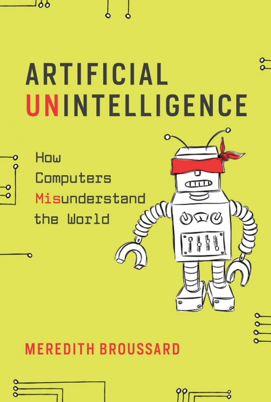
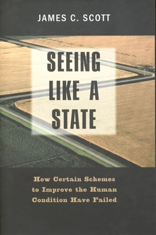
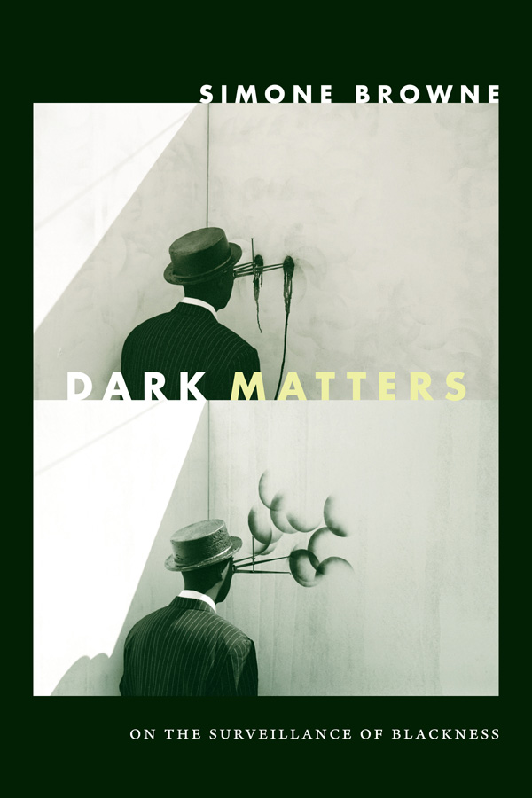
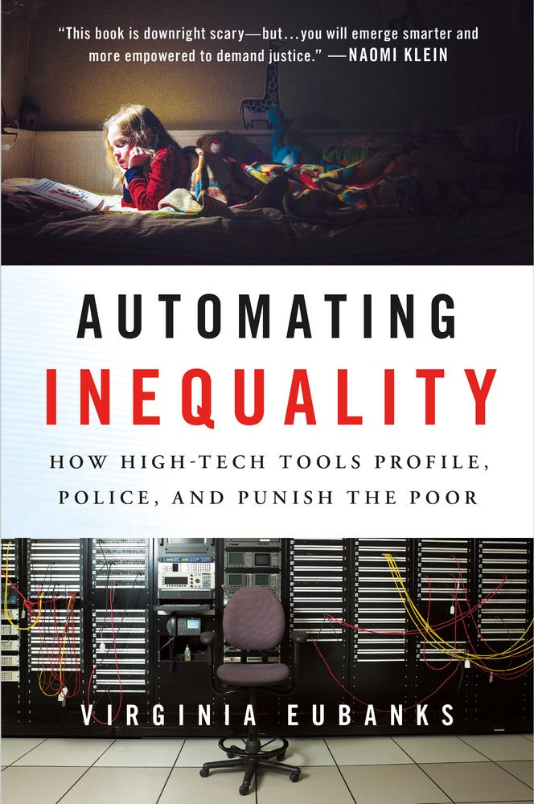
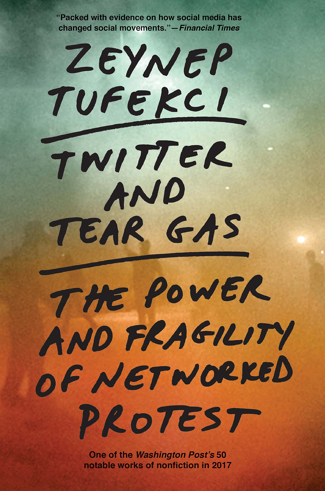

## About the Course
### Why should we care about ethical questions with respect to technology?
Computing technologies shape our personal, social, and political lives in increasingly complex and consequential ways – providing tremendous benefits (e.g. convenient access to information, connecting to one another across time and space) and harms (e.g. biased decision-making, mass surveillance, disinformation campaigns, and exclusion from critical material opportunities) that are important to examine and understand. 

At the same time, these technologies are born and shaped by the societies in which they are developed. Thus, grappling with the ethics of technologies (i.e considering the harms and benefits, how and why they were created in the first place, and how and to what ends they are used) is important not only for ultimately creating more moral technologies but a more moral society. Thus, our approach to the ethics of computing technologies requires a multifaceted assessment of their harm and benefit to our individual, cultural, and political lives, and simultaneously a critical examination of the values, ideologies, and contexts through which computing technologies emerge. 

To accomplish this, we will engage in critical reading and synthesizing across a range of topics drawn from computer science and HCI, education and learning sciences, as well as ethics and philosophy. We will also engage in hands-on activities to help us consider how technical decisions (e.g. sampling, data collection practices, categorization and classification, prediction, system design, etc.) involve human judgements that can have both intended and unintended consequences. Specifically, students will:

1. Examine the design choices and tradeoffs that various computing infrastructures make (and have made) in relation to important societal values (e.g. individual autonomy, free speech, equity, privacy, justice, security, access to opportunity, etc.).
2. Consider some of the intended and unintended consequences of computing applications within our communities, institutions, and social systems (e.g. schooling, employment, policing, transportation, business, etc.). This involves paying attention to who wins and who loses, as well as how these technologies might amplify existing marginalities and privileges.
3. Develop a variety of analytic lenses for examining computing technologies in terms of their social, ethical, and political consequences.

The course is open to all students. For CS majors and minors, the course aims to help students to consider and grapple with ethical dimensions of their work, in order to inform a more critical technical practice. For students pursuing non-computing disciplines, the course aims to provide a solid foundation for thinking about the possibilities, risks, and impacts of computer-mediated infrastructures on society.

## Course Format
The course format will consist of:
1. Readings and in-class discussions of current and enduring socio-technical dilemmas, and how they relate to applications of AI, Big Data, and the Internet.
2. In-class activities to help students to consider the potential impacts of different kinds of technical decisions (e.g. sampling, data collection practices, categorization and classification strategies, prediction, system design, etc.).
3. Reflective writing assignments that will ask you to analyze the social and ethical dimensions of contemporary technology debates.

## Required Texts
We will be reading *Race After Technology* by Ruja Benjamin (2019) in its entirety. You may purchase it (recommended), of you can access it <a href="https://ebookcentral.proquest.com/lib/northwestern/detail.action?docID=5820427">online through the Nortwestern Library</a>.
* Benjamin, R. (2019). <a href="https://www.ruhabenjamin.com/race-after-technology">Race After Technology: Abolitionist Tools for the New Jim Code</a>. John Wiley & Sons.

<!-- <section class="books">
    
    
    
    
    
    
    
    
</section> -->

## Course Format & Grading
The course format will consist of:

1. Participation (30%)
2. Homework (40%)
3. Final project or paper (30%)

### 1. Participation (30%)
Your participation grade will be based on attendance, and on evidence that you have completed the readings (as reflected both through your in-class participation as well as through the quality of your reading responses and Identity Journal entries).

#### Class Discussions
We will use classroom discussion as a form of collaborative sense-making to understand, critique, and interrogate the required [course readings](../). Your timely and engaged attendance at every class is thus very important – both for you and for your classmates. Every student will need to participate in a thoughtful and productive manner in order for these discussions to be effective. Building on and reacting to other participants’ comments is encouraged, and should be done in a respectful tone even if you disagree. In order to participate fully, please do not let your laptop, phone, or other devices distract you or other participants. 

#### Reading Responses
> **Update:** As mentioned in class, you are allowed to skip one forum discussion post without a grade penalty.

Students will also be required to submit **weekly reading responses**. Responses should be around 200-400 words in length (give or take). Sometimes, you will be given specific questions to answer. Other times you can write about themes, ideas, and questions that interested you. Your grade will be based on evidence that you did the readings. 

Some approaches that you could take include (but are not limited to):
* Summarizing of one or more key arguments of a readings and whether / how these arguments resonate with you.
* Analyzing some of the strengths or weaknesses of the article(s).
* Writing about ideas you were confused about and/or didn't entirely understand (and what about them was confusing / ambiguous).
* Sharing thoughts about how the readings connect to other readings we've done, or to current events going on in the world.
* Sharing thoughts on what you would like to learn about in more detail.

In addition to writing your own responses, you will respond to at least **two** of your classmates' posts per week. Both your writing response and your responses to your classmates should be submitted **before class (2PM) on the day it is due**. You may miss one reading response during the quarter without a grade penalty.

#### Identity Journal
> **Update:** As mentioned in class, you are allowed to skip one identity journal entry without a grade penalty.

Each student will also create an "Identity Journal" that will be updated throughout the quarter, both during and outside of class. The Identity Journal will be a personalized space for you to keep track of how core themes of the class relate directly to your own lived experiences, identities, and perspectives. It will also serve as an artifact of your learning that will be useful to you beyond the class. 

{:.blockquote-no-margin}
> **Attendance and Absence Policy**
> 
> You are allowed two unexcused absences during the quarter, no questions asked. You should reserve these absences for the occasional emergency or illness. After two absences, your participation grade will be impacted.

### 3. Homework (40%)
You will also complete 4 homework assignments, which are intended to to help you analyze existing technologies and debates using some of the ideas you're learning in the course. These will be posted on the course schedule in the second week of class.

### 4. Final Project (30%)
The current plan for the final project is for you to choose from one of the two options below. This may change.

The first is an individual paper based in the genre of speculative fiction. Imagine the state of the world in 2100. You are free to imagine based on how you see the current world evolving, or you can imagine a totally alternative reality based on your wildest dreams or fears. Using key texts from the class, you will describe in rich detail the socio-technical features of this world, and your analysis will describe the systems, policies, and decisions that got us there. If you wish, you have the option of submitting your final paper to the BreakPoint journal for publication. Shoot for 5-6 pages.

The second option is to work with a partner to create an educational tech/ethics module designed around one of the focal technologies discussed throughout the quarter. You will identify learning objectives and a target audience of learners for your module (e.g. a 7th grade social studies class, a network of human rights lawyers, a Congressional subcommittee, etc). You will create a set of learning and teaching resources which might include lesson plans, assessments, podcasts, interactive demos, etc).

### Other Grading Logistics
We will not be using the final exam time for this class because there is no midterm or final exam. Final grades are assigned on a fixed scale: 93-100 is an A, 90-92.99 is an A-, 87-89.99 is a B+, etc. Final course grades will not be curved.  

## Expectations
* You will come to class prepared and ready to engage in an intellectual discussion about the readings.
* You will complete all assignments on time and with interest, engagement, and intellectual curiosity.
* You will bring your unique expertise, perspectives, and experiences to class and share them with others, so that we might all gain from your perspectives.
* You will respect and seek to understand the unique perspectives and experiences of others.
* You will give your classmates the benefit of the doubt (about their competence and intentions) and can expect the same from them.
* All work that you submit will be your own original work; you will cite others’ work where appropriate. 

### Office Hours
Will will post our office hours schedule during the first week of classes.

## Course Learning Goals

{:.blockquote-no-margin.callout}
> ### Course Goals
> 1. [Recognizing the impact of one's own assumptions, biases, and experiences](#goal-1)
> 2. [Identifying (and questioning) dominant/normative ways of thinking about computing and technology](#goal-2)
> 3. [Understanding some of the underlying concepts that power AI and the internet](#goal-3)
> 4. [Developing a framework for thinking about the relationship between technology and society](#goal-4)
> 5. [Considering how to participate in a world that is heavily mediated by computing](#goal-5)

{:#goal-1}
### 1. Recognizing the impact of one's own assumptions, biases, and experiences
Students will appreciate and understand how their own assumptions, experiences, worldviews, social location, and identity categories can and do impact the design, implementation, and use of computing technologies. Our hope is that students across a range of majors will become more conscious, sensitive, ethically aware, and humble thinkers/doers in the world. 

{:#goal-2}
### 2. Identifying (and questioning) dominant/normative ways of thinking about computing and technology
Students will learn some techniques for recognizing social values in computer-mediated systems. This includes being able to identify how these systems can and do extend and challenge the power and reach of particular political and economic systems, cultural traditions, and societal norms -- for better or for worse.

{:#goal-3}
### 3. Understanding some of the underlying concepts that power AI and the Internet
Students will gain a high-level understanding of how a subset of computing technologies  function (e.g. page rank, third party data APIs, supervised and unsupervised learning techniques, and others); and how each of these technologies can be both beneficial and harmful. Moreover, students will be able to explain these ideas to their friends and family.

{:#goal-4}
### 4. Developing a framework for thinking about the relationship between technology and society
Students will develop a framework for considering when, how, or even if technological solutions are appropriate in a given situation. There are many ways to solve problems and shape social outcomes (e.g. law, policy, institutional supports, technologies, educational initiatives, and so forth). As such, we hope that students will recognize and value many different forms of participation and action within sociotechnical systems, and think broadly and holistically about innovation and creative problem-solving.

{:#goal-5}
### 5. Considering how to participate in a world that is heavily mediated by computing
Lastly, students will formulate ideas (or strengthen existing ones) around how they might use their own knowledge, skills, dispositions, and creativity to participate in the world going forward; and to foster a more ethical and just society. This may involve taking some future action (big or small), exploring a new idea, reading more about a topic, or something else. 

## A Note on Class Recordings
We will **NOT** be recording classes. The Provost's office has asked instructors to publish the following language in the syllabus:

{:.blockquote-no-margin}
> ### Policy On Unauthorized Student Recording of Classroom or other Academic Activities
> Unauthorized student recording of classroom or other academic activities (including advising sessions or office hours) is prohibited. Unauthorized recording is unethical and may also be a violation of University policy and state law. Students requesting the use of assistive technology as an accommodation should contact AccessibleNU. Unauthorized use of classroom recordings — including distributing or posting them — is also prohibited.  
>
> Under the University’s Copyright Policy, faculty own the copyright to instructional materials — including those resources created specifically for the purposes of instruction, such as syllabi, lectures and lecture notes, and presentations.  Students cannot copy, reproduce, display or distribute these materials. Students who engage in unauthorized recording, unauthorized use of a recording or unauthorized distribution of instructional materials will be referred to the appropriate University office for follow-up.

## Accommodations for Students with Disabilities
Any student requesting accommodations related to a disability or other condition is required to register with AccessibleNU (847-467-5530) and provide professors with an accommodation notification from AccessibleNU, preferably within the first two weeks of class. All information will remain confidential.
